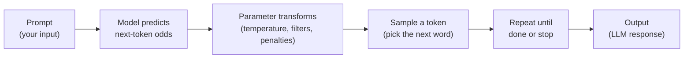

# AI Parameter Playbook — Master LLM Parameters (Free & Local-First)

Learn exactly what each LLM parameter does through **hands-on experiments on your laptop**. No APIs, no cloud costs.

## 🎓 Start Here: 45-Minute Learning Path

**Understand parameters by testing them locally:**

1. **Temperature Sweep** (5 min) ← How does randomness change?
2. **Top-p Sweep** (5 min) ← How do filters restrict candidates?
3. **Top-k Sweep** (5 min) ← How do ranked cutoffs work?
4. **Combined Filters** (10 min) ← What happens when you mix them?
5. **Repetition Penalties** (5 min) ← How do penalties work?
6. **Real Use Cases** (15 min) ← How to tune for different tasks?

**→ [Start the Learning Path](learning/00-overview.md)** (no prior knowledge needed)

Or **run the simulator right now** (5 minutes):

```bash
pip install -r requirements.txt
python3 notebooks/sampling_simulator.py
```

## Why Parameters Matter

Every LLM has the same problem: at each step, it generates probabilities for every possible next token. Parameters control *how* it picks the next token.



**The magic:** Different parameters lead to wildly different behaviors on the *same prompt*.

- **Low temperature** = deterministic, safe, boring
- **High temperature** = creative, risky, interesting
- **Top-p filters** = dynamic nucleus based on confidence
- **Penalties** = reduce repetition

This playbook teaches you to **control this intentionally.**

## Three Learning Paths

### 🎯 Path 1: Quick Intuition (30 minutes)

- [Learning Overview](learning/00-overview.md)
- [Experiment 1: Temperature](learning/01-temperature.md)
- [Experiment 2: Top-p](learning/02-top-p.md)
- [Experiment 6: Real Use Cases](learning/06-use-cases.md)

**Result:** You'll know what each parameter does and how to tune for common tasks.

### 🧠 Path 2: Deep Dive (90 minutes)

Complete all 6 experiments in sequence. Build intuition about:
- How parameters reshape distributions
- How filters interact
- How penalties discourage repetition
- How to design parameters for different use cases

**→ [Start here: Learning Path Overview](learning/00-overview.md)**

### ☁️ Path 3: Cloud Validation (optional)

Once you've mastered parameters locally, test on **any cloud platform** of your choice:

- **Azure OpenAI** – Enterprise compliance focus
- **OpenAI** – Latest models (GPT-4, o1)
- **Google Vertex AI** – Gemini family, GCP integration
- **Amazon Bedrock** – Multiple vendors (Claude, Llama, Mistral)

All platforms support the same core parameters. Learn them once, apply everywhere.

**→ [Choose Your Cloud Platform](cloud/overview.md)**

## What You'll Know After

✅ What each parameter *actually* does (math + intuition)  
✅ How parameters interact and affect each other  
✅ How to tune for different tasks (creative vs. safe)  
✅ How to diagnose parameter problems  
✅ How to apply this to any LLM (Azure, OpenAI, local, etc.)  

## Local Playground

No credentials needed. These run entirely offline:

- **[Sampling Simulator](experiments/simulator-guide.md)** – See how parameters reshape distributions
- **[Experiment Harness](experiments/experiment-harness.md)** – Run local sweeps and export CSV/JSON

Install experiment dependencies with `pip install -r requirements.txt`.

## Reference (When You're Ready)

- **[Parameter Map](parameters/parameter-map.md)** – What parameters exist?
- **[Decoding Controls](parameters/decoding.md)** – Temperature and top-p details
- **[Repetition & Novelty](parameters/repetition.md)** – Penalties explained
- **[Use Cases](use-cases/summarization.md)** – Task-specific tuning

## Authoritative References

This playbook is based on official specs:

- Azure OpenAI inference REST API (GA 2024-10-21)
- OpenAI Chat Completions API reference
- Open-source sampler implementations (llama.cpp, Hugging Face)

---

## TL;DR

**Your first step:**

```bash
pip install -r requirements.txt
python3 notebooks/sampling_simulator.py  # 2 minutes
```

Then:

**→ [Read the Learning Path Overview (5 min)](learning/00-overview.md)**

That's it. 7 minutes and you'll understand LLM parameters deeper than most people.

--8<-- "_abbreviations.md"
