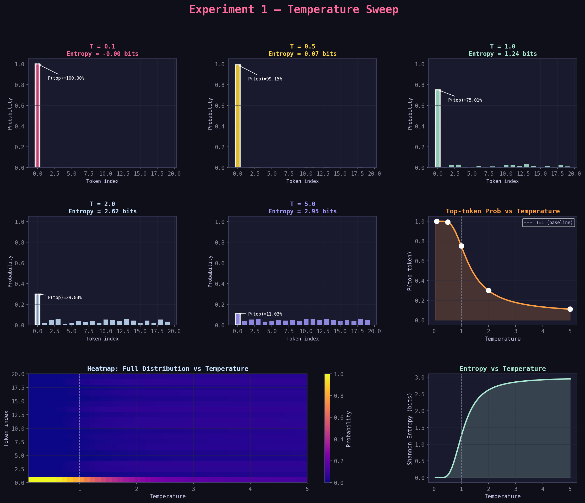

# 1: Temperature

## The Mental Model

Imagine you're a language model and someone asks you:

> *"Should I approve this request?"*

You have 10 possible answers: `approve`, `reject`, `review`, `escalate`, `delay`, `audit`, `optimize`, `notify`, `assign`, `close`.

Internally, the model doesn't just pick one word. It **scores every word** and turns those scores 
into **probabilities**. Temperature is the knob that controls *how confident* the model acts when 
sampling from those probabilities.

Think of it like this:

| Low Temperature                       | High Temperature                   |
|:--------------------------------------|:-----------------------------------|
| Model is very sure of itself          | Model spreads bets evenly          |
| "It's almost definitely `approve`"    | "Honestly any of these could work" |
| A politician giving a press statement | A brainstorming session            |
| Strict, deterministic                 | Loose, exploratory                 |

---

## Step 1: Understand What "Logits" Are

**Logits** are raw scores the model assigns to each possible next token. 
They're just numbers — they can be positive or negative.

They are computed by the model itself as the final score for each possible next token, using the hidden representation built up through the transformer layers

### How they are produced
Inside an LLM, the prompt is first turned into embeddings, then processed through many layers of
attention and feed-forward networks. At the end, the model has a **vector** that represents the 
current context, and that vector is multiplied by a learned output matrix to produce one score per vocabulary token.

### What the scores mean
Those numbers are called **logits** because they are raw, unnormalized values. 
A larger logit means the model finds that token **more compatible with the current context**, but 
the values only become probabilities after a softmax step.

In our experiment, the logits for the 10 tokens look like this:

```
Token       Logit
approve     2.2   ← model's favorite
reject      1.8
review      1.4
escalate    0.9
delay       0.2
audit       0.1
optimize   -0.3
notify     -0.6
assign     -0.8
close      -1.0   ← model's least favorite
```

**How to read this:**

- Higher logit = model thinks this token fits better
- The logit is NOT a probability yet (2.2 doesn't mean 2.2%)
- The absolute values don't matter — only the differences between them matter

> **Key insight**: The logit list is like a **ranked list** of preferences, but the ranking alone doesn't tell you *how strong* those preferences are.

---

## Step 2: Understand the Softmax Function

To turn logits into probabilities, we use **softmax**. Here's what it does in plain English:

1. Take every logit and compute `e^logit` (e = 2.718, Euler's number)
2. Add all those values up
3. Each token's probability = its `e^logit` divided by the total

The formula:

```
P(token_i) = e^(logit_i) / sum of all e^(logit_j)
```

$$
P(i) = \frac{e^{z_i}}{\sum_{j=1}^{n} e^{z_j}}
$$

**Why e^x?**

Because it has a useful property: it's **always positive**, and it makes bigger numbers
*much bigger* than smaller ones. A logit of 4.0 doesn't just beat 2.0 — it completely **dominates** it. 

This is what creates the "peaked" distribution.

**What softmax guarantees:**

- All probabilities are between 0 and 1
- All probabilities add up to exactly 1.0
- The ranking of tokens is preserved (highest logit = highest probability)

**Our example at baseline (T=1.0):**

```
Token       Logit    →    Probability
approve     2.2      →    ~0.36  (36%)
reject      1.8      →    ~0.24  (24%)
review      1.4      →    ~0.16  (16%)
escalate    0.9      →    ~0.10  (10%)
delay       0.2      →    ~0.05  (5%)
audit       0.1      →    ~0.04  (4%)
optimize   -0.3      →    ~0.03  (3%)
notify     -0.6      →    ~0.02  (2%)
assign     -0.8      →    ~0.01  (1%)
close      -1.0      →    ~0.01  (<1%)
```

So at baseline, if you sample 100 times, you'd get `approve` about 36 times, `reject` about 24 times, etc.

---

## Step 3: Understand What Temperature Does to Logits

**Temperature changes the logits BEFORE softmax is applied.**

The formula:

```
scaled_logit_i = logit_i / T
```
where T = temperature

That's it. Just divide every logit by T. Then softmax runs on these scaled logits.

Let's trace what happens step by step for two temperatures:

### Case A: T = 0.5 (low temperature, more confident)

Divide all logits by 0.5:

```
Token       Original    Divided by 0.5
approve     2.2     →   4.4
reject      1.8     →   3.6
review      1.4     →   2.8
escalate    0.9     →   1.8
...
close      -1.0     →  -2.0
```

The *differences* between logits **got bigger** (approve vs close: was 3.2, now 6.4). 

> When softmax runs on these bigger differences, the winner **dominates** much more.

### Case B: T = 2.0 (high temperature, less confident)

**Divide all logits by 2.0:**

```
Token       Original    Divided by 2.0
approve     2.2     →   1.1
reject      1.8     →   0.9
review      1.4     →   0.7
escalate    0.9     →   0.45
...
close      -1.0     →  -0.5
```

The differences got smaller (approve vs close: was 3.2, now 1.6). When softmax runs on these 
compressed differences, the probabilities are much more equal.

### The Critical Insight

> **Temperature does NOT change the token ranking.**  
> Temperature is **inversely proportional** to the "confidence gap" between tokens, but the order of which token is most likely doesn't change.
> `approve` is still #1 at T=0.1 and at T=5.0.  
> Temperature only changes **how much more likely the top token is than the others**.


## Entropy: The Single Number That Captures Distribution Shape

Entropy is useful because it tells you how spread out the model’s next-token probability distribution is. Temperature changes that spread, and entropy gives you a single number that summarizes it

A compact way to say it is: temperature controls the distribution, while entropy measures the result of that distribution.

### How entropy is calculated

Once you have next-token probabilities p1, p2, ..., pn, where each p is between 0 and 1 and they sum to 1,

Shannon entropy is calculated as:

$$
H = -\sum_{i=1}^{n} p_i \log(p_i)
$$

The exact log base depends on the units you want;
- base 2 gives bits, 
- natural log gives nats. 

The choice is just a unit convention, like using Celsius vs Fahrenheit.

in ML, Entropy is measured in bits because the common machine-learning definition uses base-2 logarithms, 
and that makes the unit “how many binary yes/no questions of uncertainty” you have on average.


### Practical intuition

Think of logits as the raw preference scores, temperature as the knob that sharpens or flattens those preferences, and entropy as the summary of how uncertain the final distribution is.

---

## Step 4: Read the Graphs — Panel by Panel

The graph `exp1_temperature.png` has several panels. Here's how to read each one:

---

### Panel 1–5: The Individual Bar Charts (top two rows, left side)

Each bar chart shows the **probability distribution** for one temperature value.

**What you're looking at:**

- X-axis: each of the 20 tokens (labeled Token 0, Token 1, etc.)
- Y-axis: probability (0 = impossible, 1.0 = certain)
- Bar height = how likely the model is to pick that token

**How to interpret:**

```
T = 0.1  →  One bar is near 1.0, everything else is basically flat near zero
             = Model is almost certain. Sample 1000 times → same answer 990+ times.

T = 0.5  →  Top bar is tall, next few are visible, rest still near zero
             = Model is fairly confident but alternatives exist.

T = 1.0  →  Top bar maybe 0.35, next bars clearly visible
             = Baseline behavior. Mix of confidence and diversity.

T = 2.0  →  All bars become more similar heights
             = Model is unsure. Many tokens have meaningful probability.

T = 5.0  →  All bars are nearly identical heights
             = Model is almost completely random. Like rolling a 20-sided die.
```

**The white-bordered bar**: That's the token with the highest probability. The annotation shows `P(top)=X%` — that percentage shrinks as temperature rises.

**The "Entropy = X bits" in the title**: More on this in Step 5, but higher = more spread out = more random.

 

---

### Panel 6: "Top-token Prob vs Temperature" (right side, middle row)

This is a **line chart** where:

- X-axis: temperature (from 0.05 to 5.0)
- Y-axis: probability of the single most likely token
- White dots: the 5 specific temperatures you tested

**How to read it:**

The curve drops steeply from left to right:

- At T=0.1: top token has ~97% probability (model almost always picks it)
- At T=1.0: top token has ~36% probability (baseline)
- At T=5.0: top token has ~15% probability (barely more likely than random)

The dashed vertical line at T=1.0 is the baseline reference.

**What the curve shape tells you:**

The drop is not linear — it's steeper at low temperatures. Going from T=0.1 to T=0.3 makes a huge difference. Going from T=3.0 to T=5.0 makes very little difference. This is the "diminishing returns" zone.

> **Practical reading**: If you want to find the sweet spot between "too deterministic" and "too random", look for where the curve starts to flatten. That's usually around T=0.7–1.2.

---

### Panel 7: "Entropy vs Temperature" (right side, bottom row)

**Entropy** is a number that measures "how spread out" a probability distribution is:

- Entropy = 0: One option has 100% probability. Zero randomness.
- Entropy = maximum: All options equally likely. Maximum randomness.

The unit is **bits**. For a 20-token vocabulary, maximum entropy is about 4.32 bits (log₂ of 20).

**How to read this chart:**

- X-axis: temperature
- Y-axis: Shannon entropy in bits
- The line rises smoothly as temperature increases

```
Low entropy (< 1 bit)   = Very peaked, deterministic behavior
Medium entropy (1–3 bit) = Balanced, diverse but not random
High entropy (3–4 bit)  = Very flat, nearly random
```

**Why entropy matters more than just looking at the top probability:**

Imagine two distributions:

- Distribution A: [0.9, 0.05, 0.05] — entropy is low, model mostly picks token 0
- Distribution B: [0.4, 0.4, 0.2] — entropy is higher, model is genuinely split

Both have a clear "winner" but they behave very differently when sampled repeatedly. Entropy captures this full picture in a single number.

---

### Panel 8: The Heatmap (bottom left, spanning two columns)

This is the most information-dense panel. It shows the **full distribution** across all 20 tokens across 50 temperature values simultaneously.

**What you're looking at:**

- X-axis: temperature (left = 0.1, right = 5.0)
- Y-axis: token index (bottom = token 0, top = token 19)
- Color: probability (brighter/yellower = higher probability, darker/purple = lower)

**How to read it:**

At the far left (low T):

- Token 0 has a very bright bar — it's capturing almost all the probability
- Tokens 1–19 are mostly dark purple (near zero)

As you move right (higher T):

- Token 0's bar dims gradually
- Other tokens' bars brighten
- By T=5.0, all tokens are roughly the same shade of medium brightness

**The white dashed vertical line** marks T=1.0 (baseline). Notice the transition from concentrated to spread happens roughly around this point.

**What this tells you at a glance:**

- A distribution with one bright token + many dark tokens = low entropy, high confidence
- A distribution where all tokens are medium brightness = high entropy, random

> **Pro tip**: The heatmap lets you see which specific tokens "activate" as temperature rises. Some tokens go from nearly impossible to meaningful contributors. Those are the tokens that represent creative or unusual alternatives.

---

## Step 5: The Mental Walkthrough — Run It In Your Head

Here's a simulation of what happens when you change temperature, step by step:

### Scenario: Classify a customer service request

You feed an LLM this prompt:
> *"Customer says their order is late. Action: ___"*

Model internal logits (simplified to 5 tokens):

```
escalate   : 2.5
notify     : 2.0
delay      : 0.8
close      : -0.5
optimize   : -1.2
```

**At T = 0.2 (very deterministic):**

Scaled logits: [12.5, 10.0, 4.0, -2.5, -6.0]
→ Softmax → probabilities: [~0.92, ~0.07, ~0.01, ~0.00, ~0.00]

Behavior: Model says `escalate` 92% of the time. Reliable, consistent, predictable. Good for a production system.

**At T = 1.0 (baseline):**

Scaled logits: [2.5, 2.0, 0.8, -0.5, -1.2]
→ Softmax → probabilities: [~0.52, ~0.32, ~0.12, ~0.03, ~0.01]

Behavior: Model says `escalate` 52% of the time, `notify` 32% of the time. Still mostly right but with variation.

**At T = 2.0 (creative):**

Scaled logits: [1.25, 1.0, 0.4, -0.25, -0.6]
→ Softmax → probabilities: [~0.35, ~0.27, ~0.15, ~0.12, ~0.11]

Behavior: Still prefers `escalate` but `notify`, `delay`, and even `close` get real probability. You'd see different answers on different runs. Bad for classification, potentially useful for generating diverse scenarios.

---

## Step 6: Why This Matters — Practical Decision Guide

Use this decision tree when you're setting temperature in a real project:

```
Is there ONE correct answer? (classification, factual QA, code)
    YES → Use T = 0.1 to 0.3
    NO  → Is coherence and quality still important?
              YES → Use T = 0.5 to 0.8  (most production tasks)
              NO (exploring/brainstorming) → Use T = 0.9 to 1.5
```

### The Five Temperature "Zones"

**Zone 1: T = 0.0 to 0.2 — Greedy/Deterministic**

- Same answer every time (or nearly so)
- Use for: classification labels, extracting structured data, code with strict syntax, factual answers
- Risk: Can be repetitive, may miss correct answers that require slight variation

**Zone 2: T = 0.2 to 0.5 — Focused**

- Strong preference for the top tokens, slight variation
- Use for: summarization, question answering, customer support, most professional tasks
- Risk: May be slightly "stiff" or formulaic

**Zone 3: T = 0.5 to 0.8 — Balanced (most common production setting)**

- Good balance between consistency and natural-sounding variation
- Use for: chatbots, writing assistance, code generation, general assistants
- Risk: Some outputs will differ significantly — requires quality checking

**Zone 4: T = 0.8 to 1.2 — Creative**

- Model takes risks, tries unusual combinations
- Use for: brainstorming, creative writing, generating varied examples
- Risk: Some outputs will be weird or off-topic

**Zone 5: T > 1.5 — Exploratory**

- Model is essentially rolling dice
- Use for: research/testing, understanding the model's vocabulary, stress testing
- Risk: Often produces incoherent or nonsensical text in production

---

## Step 7: Common Misconceptions — Cleared Up

**Misconception 1: "Higher temperature makes the model smarter/more creative"**

Not exactly. Higher temperature makes the model *less predictable*, which can look like creativity. But the model's knowledge and capabilities don't change. A high temperature can produce brilliant unusual ideas OR complete nonsense — you can't control which. Temperature changes the *distribution of outputs*, not the quality of the model's underlying knowledge.

**Misconception 2: "Temperature = 0 gives the best answer"**

Temperature = 0 (greedy decoding) gives the *most probable* answer, not necessarily the *best* answer. Sometimes the second or third most likely token leads to a better overall sentence or idea. Greedy decoding can also get stuck in repetitive loops because it always picks the same token given the same context.

**Misconception 3: "The temperature I set applies to the whole generation"**

True for standard APIs, but some advanced systems apply different temperatures to different parts of the output (e.g., stricter at the start of a list, looser for creative expansions). Keep this in mind when you see fine-grained control systems.

**Misconception 4: "Low temperature means the model is thinking harder"**

Temperature is applied *after* the model has _**already done all its thinking**_ (the forward pass). It only affects the sampling step. The model's reasoning quality doesn't change — you're just changing how you pick from the resulting probability distribution.

---

## Step 8: How to Read the Sample Output Text

In the original experiment, you'd see output like:

```
=== T=0.1 (extreme determinist) ===
Entropy: 0.412
approve       0.967
reject        0.023
review        0.005
escalate      0.002
delay         0.001
audit         0.001
optimize      0.000
notify        0.000
assign        0.000
close         0.000
```

**Reading guide:**

| Field | What it means |
|-------|---------------|
| `Entropy: 0.412` | Very low — nearly all probability mass on one token |
| `approve 0.967` | 96.7% probability. If you sample 1000 times, ~967 are "approve" |
| `reject 0.023` | 2.3% probability. Rare but possible |
| `review 0.005` | 0.5% probability. Almost never |
| Everything else | Effectively zero — these tokens are off the table |

```
=== T=2.0 (very creative) ===
Entropy: 2.891
optimize      0.152
approve       0.138
notify        0.134
reject        0.121
review        0.106
escalate      0.088
delay         0.082
audit         0.075
assign        0.068
close         0.036
```

**Reading guide:**

| Field            | What it means                                      |
|:-----------------|:---------------------------------------------------|
| `Entropy: 2.891` | High — many tokens have meaningful probability     |
| `optimize 0.152` | Highest at 15.2% — but that's a very slim lead     |
| `approve 0.138`  | 13.8% — barely behind optimize                     |
| `close 0.036`    | 3.6% — even the "worst" token has real probability |

Notice that at T=2.0, `optimize` is now the top token — but `approve` had a higher logit! This happens because high temperature flattens the distribution enough that statistical noise and renormalization can temporarily shift ranks. This is one reason very high temperatures can feel "wrong" — the model's actual preferred answer is no longer the most sampled one.

---

## Step 9: Worked Example — Calculating by Hand

Let's manually calculate probabilities for 3 tokens at T=0.5 and T=2.0.

**Original logits:**
- approve: 2.2
- reject: 1.8
- review: 1.4

**Step 1: Scale by temperature**

```
At T=0.5:           At T=2.0:
approve → 2.2/0.5 = 4.4    approve → 2.2/2.0 = 1.1
reject  → 1.8/0.5 = 3.6    reject  → 1.8/2.0 = 0.9
review  → 1.4/0.5 = 2.8    review  → 1.4/2.0 = 0.7
```

**Step 2: Apply e^x (exponentiate)**

```
At T=0.5:                   At T=2.0:
e^4.4 ≈ 81.5               e^1.1 ≈ 3.00
e^3.6 ≈ 36.6               e^0.9 ≈ 2.46
e^2.8 ≈ 16.4               e^0.7 ≈ 2.01
Sum   = 134.5              Sum   = 7.47
```

**Step 3: Divide by sum (normalize)**

```
At T=0.5:                   At T=2.0:
approve  = 81.5/134.5 = 60.6%    approve = 3.00/7.47 = 40.2%
reject   = 36.6/134.5 = 27.2%    reject  = 2.46/7.47 = 32.9%
review   = 16.4/134.5 = 12.2%    review  = 2.01/7.47 = 26.9%
```

**What changed:**

- At T=0.5: `approve` has 60.6% — a strong lead
- At T=2.0: `approve` has 40.2% — still leads but far from dominant
- At T=2.0: `review` went from 12.2% to 26.9% — a huge jump!

This is the core mechanism. Low T amplifies differences. High T compresses them.

---

## Step 10: What to Do Next

Now that you understand temperature deeply, you're ready to understand why it interacts with the other parameters:

1. **Top-p** (Experiment 2): Even with a good temperature, you might want to exclude very low-probability tokens entirely. Top-p does this dynamically.

2. **Top-k** (Experiment 3): A simpler, fixed-size version of top-p filtering.

3. **Repetition Penalty** (Experiment 5): Adjusts logits *after* temperature, but *before* sampling. Understanding temperature makes repetition penalty obvious.

---

## Quick Reference: Graph Interpretation Cheat Sheet

When you open `exp1_temperature.png`, scan in this order:

```
1. Look at the bar chart panels
   → Are the bars peaked (one tall bar) or flat (all similar)?
   → Peaked = low T, flat = high T

2. Look at entropy values in the panel titles
   → < 1.0 bits = very deterministic
   → 1.0–2.5 bits = balanced
   → > 2.5 bits = highly random

3. Look at the "Top-token Prob" line chart
   → Where does the curve flatten? That's where further T increases stop mattering much
   → The white dots are your specific test temperatures

4. Look at the entropy curve
   → Should mirror the top-token curve (as top prob drops, entropy rises)
   → Check that they're consistent

5. Look at the heatmap
   → Which tokens "light up" as T increases?
   → How many tokens get above ~10% probability at high T?
```

---

## Summary

| Concept     | One-sentence explanation                                                     |
|:------------|:-----------------------------------------------------------------------------|
| Logit       | Raw score the model assigns to a token — just a number                       |
| Softmax     | Converts logits to probabilities that sum to 1                               |
| Temperature | Divides all logits before softmax — compresses or expands differences        |
| Low T       | Amplifies differences → confident, deterministic                             |
| High T      | Compresses differences → uncertain, diverse                                  |
| Entropy     | One number measuring how spread out a distribution is                        |
| The heatmap | Shows full distribution across all tokens at all temperatures simultaneously |

> **Final takeaway**: Temperature is the most important parameter to understand first because every other parameter in LLM sampling operates on top of the temperature-scaled distribution. Master this, and the rest becomes intuitive.

---

*Part of the 6-Experiment LLM Parameter Learning Path*  
*Next: Experiment 2 — Top-p (Nucleus Sampling)*

## Optional: Dive Deeper

Plot entropy vs. temperature (including very high values like `T=5.0` if you want to see near-uniform behavior):

```python
import matplotlib.pyplot as plt

temps = [0.1, 0.2, 0.5, 1.0, 1.5, 2.0, 5.0]
entropies = []

for t in temps:
    out = run_experiment(tokens, logits, temperature=t, n_samples=10000)
    entropies.append(out['entropy'])

plt.plot(temps, entropies, marker='o')
plt.xlabel('Temperature')
plt.ylabel('Entropy')
plt.title('How Temperature Affects Distribution Spread')
plt.grid(True)
plt.show()
```

## Takeaway

> **Temperature is the master randomness dial:** it smoothly moves behavior from "pick best token" to "sample broadly".

👉 Next: **[Experiment 2: Top-p (Nucleus Sampling)](02-top-p.md)**

--8<-- "_abbreviations.md"
