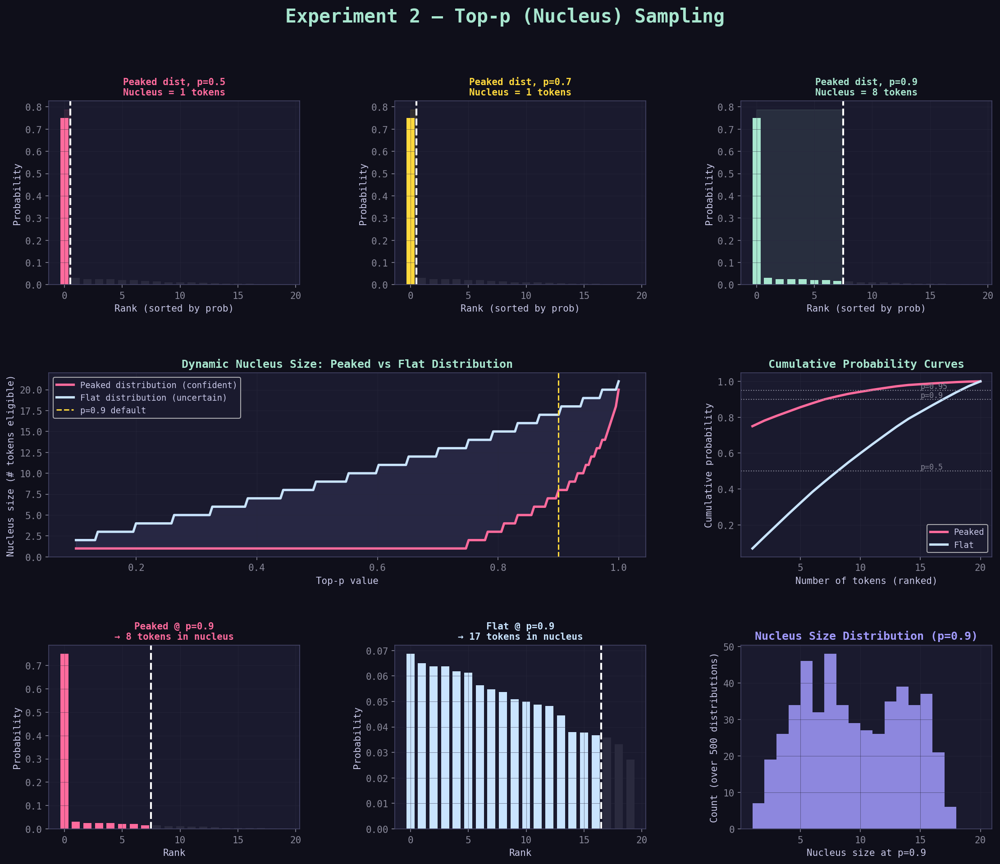

# Experiment 2: Top-p (Nucleus Sampling)

> **Who it's for**: Anyone who completed Experiment 1 and wants to understand nucleus sampling deeply.  
> **What you'll get**: The ability to look at any top-p graph and immediately understand what it's telling you — and why top-p behaves so differently from temperature.

---

## Before You Start: The Problem Temperature Alone Doesn't Solve

You learned in Experiment 1 that temperature **_reshapes_** probability distributions. 
But temperature has a fundamental _**limitation**_: **it always includes every token in the sampling pool**.

Even at T=0.5, tokens with logit=-1.0 still have *some* probability. Usually tiny — but "tiny" adds
up when you're generating thousands of tokens. Occasionally the model will sample from these 
near-zero tokens, producing surprising or incoherent output.

Top-p(Nucleus Sampling) solves this by asking a different question:

> Instead of "how do I reshape the probabilities?", it asks:  
> "Which tokens together account for most of the probability mass — and can I just ignore the rest?"

This is a fundamentally different kind of intervention.

---

## The Core Intuition: The Probability Budget

Think of probability as a budget of 1.0 (or 100%).

At baseline (T=1.0), our 10 tokens spend that budget like this:

```
approve    → 0.36  (36%)
reject     → 0.24  (24%)
review     → 0.16  (16%)
escalate   → 0.10  (10%)
delay      → 0.05  (5%)
audit      → 0.04  (4%)
optimize   → 0.03  (3%)
notify     → 0.02  (2%)
assign     → 0.01  (1%)
close      → 0.01  (<1%)
Total:        1.00  (100%)
```

Top-p says: **"I only want to spend my probability budget on the most important tokens."**

- `p = 0.5` means: "Find the fewest tokens that together use up 50% of the budget — ignore the rest."
- `p = 0.9` means: "Find the fewest tokens that together use up 90% of the budget — ignore the rest."
- `p = 1.0` means: "Include everything — no filtering at all."

> The set of tokens you **keep** is called the **nucleus**.

---

## Step 1: Understand the Algorithm — Exactly How Top-p Works

Here is the top-p algorithm, step by step:

1. Start with the probability distribution **after softmax**
   (optionally after temperature scaling)

2. Sort all tokens from highest to lowest probability

3. Walk down the sorted list, accumulating probability
   Stop when the cumulative sum first reaches or exceeds p

4. The tokens you've accumulated = the nucleus

5. Discard all other tokens (set their probability to zero)

6. Renormalize: divide each surviving token's probability
   by the total nucleus probability (so they sum to 1.0 again)

7. Sample from this renormalized nucleus

The key word is **"smallest set"**. 
Top-p finds the **minimum number** of tokens needed to cover probability `p`. No more, no less.

---

## Step 2: Trace the Algorithm Manually

Let's run through top-p = 0.8 by hand, using our token list.

**Starting distribution (T=1.0, already sorted):**

```
Rank  Token      Probability   Cumulative
  1   approve    0.360         0.360
  2   reject     0.240         0.600
  3   review     0.160         0.760
  4   escalate   0.100         0.860   ← first point where cumulative ≥ 0.80
  5   delay      0.050         0.910
  6   audit      0.040         0.950
  7   optimize   0.030         0.980
  8   notify     0.020         1.000
  9   assign     0.010         1.010
 10   close      0.010         1.020
```

**With p = 0.80:**

Walk down the list until cumulative sum ≥ 0.80:

- After approve: 0.36 → not yet
- After reject: 0.60 → not yet
- After review: 0.76 → not yet
- After escalate: 0.86 → **crossed 0.80, stop here**

Nucleus = {approve, reject, review, escalate}

Discard: delay, audit, optimize, notify, assign, close (set to 0)

**Renormalize the nucleus:**

Total nucleus probability = 0.360 + 0.240 + 0.160 + 0.100 = 0.860

```
approve   → 0.360 / 0.860 = 0.419  (41.9%)
reject    → 0.240 / 0.860 = 0.279  (27.9%)
review    → 0.160 / 0.860 = 0.186  (18.6%)
escalate  → 0.100 / 0.860 = 0.116  (11.6%)
Total:                      1.000  (100%)
```

Now sample from just these four tokens.

**Notice what changed:** approve went from 36% → 41.9%. All the discarded tokens' probability
got **redistributed** to the survivors. 
The ranking stays the same, but the numbers shift upward slightly.

---

## Step 3: Trace Three More p Values

Let's see how the nucleus changes across the five experiment runs:

### p = 0.20

Walk down until cumulative ≥ 0.20:
- After approve: 0.36 → **already crossed 0.20, stop**

Nucleus = {approve} — only ONE token!

Renormalized: approve = 100%

This is essentially deterministic. No matter how many times you sample, you always get `approve`.

---

### p = 0.50

Walk down until cumulative ≥ 0.50:
- After approve: 0.36 → not yet
- After reject: 0.60 → **crossed 0.50, stop**

Nucleus = {approve, reject}

Renormalized:
```
approve → 0.360 / 0.600 = 60.0%
reject  → 0.240 / 0.600 = 40.0%
```

Only two choices. Every sample is either approve (60%) or reject (40%).

---

### p = 0.95

Walk down until cumulative ≥ 0.95:
- approve: 0.36
- reject: 0.60
- review: 0.76
- escalate: 0.86
- delay: 0.91
- audit: 0.95 → **crossed 0.95, stop**

Nucleus = {approve, reject, review, escalate, delay, audit} — 6 tokens

Renormalized: all 6 tokens divided by 0.95 ≈ each goes up slightly.

---

### p = 1.00

Walk down until cumulative ≥ 1.00:
This requires all 10 tokens.

Nucleus = everything. No filtering occurs. Equivalent to not using top-p at all.

---

### Summary Table

```
p = 0.20  →  1 token  in nucleus  (approve only)
p = 0.50  →  2 tokens in nucleus  (approve, reject)
p = 0.80  →  4 tokens in nucleus  (approve, reject, review, escalate)
p = 0.95  →  6 tokens in nucleus  (approve through audit)
p = 1.00  → 10 tokens in nucleus  (everything)
```

> **The pattern**: as p increases, more tokens enter the nucleus. The nucleus grows to match the probability you're willing to "spend."

---

## Step 4: The Dynamic Property — Why This Matters More Than You Think

Here is the most important concept in Experiment 2, and the reason top-p is preferred over top-k in most production systems.

**The nucleus size changes depending on how confident the model is.**

To see this, compare the same p=0.90 applied to two different distributions:

### Distribution A: Model is very confident (peaked)

```
Token A1   0.82
Token A2   0.10
Token A3   0.05
Token A4   0.02
Token A5   0.01
```

Walk with p=0.90:
- A1: 0.82 — not yet
- A2: 0.92 — crossed! Stop.

Nucleus = {A1, A2} — just 2 tokens. The model is so sure that 90% of the budget is spent in 2 tokens.

### Distribution B: Model is very uncertain (flat)

```
Token B1   0.15
Token B2   0.13
Token B3   0.12
Token B4   0.11
Token B5   0.10
Token B6   0.10
Token B7   0.09
Token B8   0.08
Token B9   0.07
Token B10  0.05
```

Walk with p=0.90:
- B1: 0.15
- B2: 0.28
- B3: 0.40
- B4: 0.51
- B5: 0.61
- B6: 0.71
- B7: 0.80
- B8: 0.88
- B9: 0.95 — crossed! Stop.

Nucleus = {B1 through B9} — 9 tokens. The model is so unsure that even 9 tokens only cover 95% of the budget.

**Same p=0.90. One case: 2 tokens. Other case: 9 tokens.**

This is why it's called "dynamic" nucleus sampling. The nucleus size *adapts* to the shape of the distribution automatically. No tuning needed.

---

## Step 5: Temperature vs Top-p — The Exact Difference

This is the comparison that confuses most people. Both affect which token gets sampled —
but they work at completely different stages and in completely different ways.

### Temperature: changes the shape of the whole distribution

```
Before temperature:   [0.36, 0.24, 0.16, 0.10, 0.05, 0.04, 0.03, 0.02, 0.01, 0.01]
After T=0.5:          [0.61, 0.27, 0.09, 0.02, 0.00, 0.00, 0.00, 0.00, 0.00, 0.00]
After T=2.0:          [0.20, 0.17, 0.14, 0.11, 0.09, 0.08, 0.08, 0.07, 0.06, 0.05]
```

Every token is still there. Every token still has some probability. The shape changed, but nobody was excluded.

### Top-p: cuts off the tail entirely

```
Before top-p:         [0.36, 0.24, 0.16, 0.10, 0.05, 0.04, 0.03, 0.02, 0.01, 0.01]
After p=0.80:         [0.42, 0.28, 0.19, 0.12,  0,    0,    0,    0,    0,    0  ]
After p=0.50:         [0.60, 0.40,  0,    0,    0,    0,    0,    0,    0,    0  ]
```

The tail is gone. Zeroed out. Those tokens can never be sampled, no matter what.

### The operational difference

| Question                                      | Temperature                                      | Top-p                             |
|:----------------------------------------------|:-------------------------------------------------|:----------------------------------|
| Can the 10th-ranked token ever be sampled?    | Yes, always                                      | Only if p=1.0                     |
| Does the ranking of surviving tokens change?  | Yes (e^x math can shift ranks at extreme T)      | No, never                         |
| Does it help with very long generation loops? | Somewhat                                         | Yes, strongly                     |
| What does "more" do?                          | More temperature = more random across all tokens | More top-p = more tokens eligible |

### When to use which

| Situation                                               | Use Temperature  |  Use Top-p  |
|:--------------------------------------------------------|:----------------:|:-----------:|
| Want more variety in phrasing                           |        ✓         |             |
| Want to completely block low-quality tokens             |                  |      ✓      |
| Generating long sequences where tail tokens cause loops |                  |      ✓      |
| Want smooth gradation from focused to random            |        ✓         |             |
| Want a hard cutoff with no bleed-through                |                  |      ✓      |

> **In practice**: Most systems use both. Temperature first (to reshape), then top-p (to trim the tail).

---

## Step 6: Read the Graphs — Panel by Panel

The graph `exp2_top_p.png` has 8 panels across 3 rows. Here is how to read each one.



---

### Row 1, Panels 1–3: "Peaked dist, p=X — Nucleus = N tokens"

These three bar charts show the nucleus for three different p values applied to the peaked distribution.

**What you're looking at:**
    
- X-axis: tokens sorted from highest to lowest probability (rank order, not token index)
- Y-axis: probability
- Colored bars: tokens inside the nucleus
- Dark (near-black) bars: tokens outside the nucleus (discarded)
- White dashed vertical line: the nucleus cutoff boundary
- Colored shaded region: the nucleus area

**How to read it:**

```
p=0.50 panel:  2 colored bars, 18 dark bars
               → Nucleus has only 2 tokens
               → The vertical line is very far left
               → The shaded region is tiny

p=0.70 panel:  More colored bars, fewer dark bars
               → Nucleus grew to include more tokens
               → The vertical line moved right

p=0.90 panel:  Even more colored bars
               → Nucleus grew again
               → The cutoff is now much further right
```

**What the relative bar heights tell you:**

After top-p is applied, the surviving bars don't change in relative order — but they shift upward slightly because the normalization step redistributes the discarded tokens' probability to the survivors. The taller bars grow taller, the shorter bars grow a bit too. This is the renormalization effect.

---

### Row 2, Left: "Dynamic Nucleus Size: Peaked vs Flat Distribution"

This is the most important graph in the panel. It directly visualizes the dynamic property.

**What you're looking at:**
- X-axis: p value (from 0.1 to 1.0)
- Y-axis: number of tokens in the nucleus
- Pink line: nucleus size for the peaked distribution
- Blue line: nucleus size for the flat distribution
- Yellow dashed line: p=0.9 (the common default)
- Shaded area between lines: the "gap" showing how differently they behave

**How to read it:**

The pink line (peaked distribution) stays very low for most of the range. It doesn't need many tokens to cover p=0.9 because a few tokens already dominate.

The blue line (flat distribution) rises steeply. It needs many more tokens to reach the same p because the probability is spread evenly.

**The key observation**: At p=0.9 (yellow line), read across to where each line hits it. The pink line hits it at maybe 2–3 tokens. The blue line hits it at 12–15 tokens. Same p value, wildly different nucleus size.

**The shaded gap between lines**: This is your visual intuition for "how dynamic is top-p?" The bigger the gap, the more top-p is adapting to the distribution. A large gap is a good thing — it means top-p is doing its job of adjusting to context.

**What the slope of each line means:**

A steep slope means nucleus size grows quickly as p increases — many tokens are "roughly equally" probable, so each increment of p adds several tokens. A flat slope means nucleus size grows slowly — a few tokens dominate, so p can grow a lot before needing to add another token.

---

### Row 2, Right: "Cumulative Probability Curves"

This graph shows the raw data that the top-p algorithm is walking through.

**What you're looking at:**

- X-axis: number of tokens accumulated (rank 1, 2, 3, ...)
- Y-axis: cumulative probability
- Pink line: cumulative sum for the peaked distribution
- Blue line: cumulative sum for the flat distribution
- Three dotted horizontal lines: p=0.5, p=0.9, p=0.95

**How to read it:**

Each line starts at the bottom-left and rises to 1.0 at the top-right.

The pink line rises steeply at first — one token covers most of the probability — then flattens out. This is the visual signature of a peaked distribution.

The blue line rises gradually and nearly linearly — no single token dominates. This is the visual signature of a flat distribution.

**Reading nucleus size from this graph:**

Draw a horizontal line at your target p (e.g., 0.9). Where it crosses each curve, drop a vertical line to the x-axis. That x-value is your nucleus size.

For the peaked distribution at p=0.9: the horizontal line crosses the pink curve at about x=3. Nucleus = 3 tokens.

For the flat distribution at p=0.9: the horizontal line crosses the blue curve at about x=13. Nucleus = 13 tokens.

> **Pro tip**: The shape of these curves tells you everything about how top-p will behave on a given distribution. A curve that jumps steeply = small nucleus. A curve that rises slowly = large nucleus.

---

### Row 3, Panels 1–2: "Peaked @ p=0.9" and "Flat @ p=0.9"

These two panels show the practical impact of the dynamic property side by side.

**Left panel (Peaked @ p=0.9):**

You'll see most bars are dark — a small nucleus. The cutoff line appears early in the rank order.

**Right panel (Flat @ p=0.9):**

You'll see most bars are colored — a large nucleus. The cutoff line appears late in the rank order.

**The visual "aha" moment**: Same p=0.9 setting. Completely different behavior. This is the whole point of top-p — it adapts.

---

### Row 3, Right: "Nucleus Size Distribution (p=0.9)"

This histogram shows what happens when you apply p=0.9 to 500 *randomly generated* distributions.

**What you're looking at:**

- X-axis: nucleus size (how many tokens were included)
- Y-axis: how many of the 500 distributions produced that nucleus size

**How to read it:**

The histogram shows the range of possible nucleus sizes you encounter "in the wild." It's rarely a fixed number. Most distributions produce a nucleus of somewhere between 2 and 10 tokens at p=0.9, with a peak somewhere in between.

**Why this matters:**

If you were using top-k instead of top-p, you'd have to pick one fixed k value. But as this histogram shows, the "right" k would vary from 1 to 15+ depending on the distribution. Top-p handles all of these automatically with a single p=0.9 setting.

---

## Step 7: The Renormalization Effect — Often Overlooked

When top-p cuts tokens from the tail, it doesn't just remove them. It **renormalizes** the remaining probabilities so they still sum to 1.0.

This has a subtle but important effect:

**Before filtering (p=0.5 example):**
```
approve  0.360  (36%)
reject   0.240  (24%)  ← cumulative = 60%, past p=0.5, so we stop here
[rest discarded]
```

The nucleus has total probability = 0.360 + 0.240 = 0.600 (60%)

**After renormalization:**
```
approve  0.360 / 0.600 = 0.600  (60%)   ← was 36%, now 60%
reject   0.240 / 0.600 = 0.400  (40%)   ← was 24%, now 40%
```

**What changed:**

The ratio between approve and reject stayed the same (3:2 → still 3:2). But both probabilities increased because the "discarded" 40% got folded back in.

**The practical consequence:**

When you apply p=0.5, you're not just "removing" the bottom 50% of tokens. You're implicitly saying: "Pretend the model only knows these top tokens. Renormalize as if they're the whole universe."

This is why very low p values make output feel more confident than even a low temperature would — not only are bottom tokens removed, but the top tokens each get a boosted probability.

---

## Step 8: The Sample Output — How to Read It

From the original experiment, the output at p=0.20 looks like:

```
=== Top-p=0.2 (very tight) ===
Entropy: 0.721
approve       0.667
reject        0.333
review        0.000
escalate      0.000
delay         0.000
audit         0.000
optimize      0.000
notify        0.000
assign        0.000
close         0.000
```

**Reading guide:**

| What you see       | What it means                                                     |
|:-------------------|:------------------------------------------------------------------|
| `Entropy: 0.721`   | Low but not zero — two tokens survive, so there's some randomness |
| `approve 0.667`    | 66.7% chance — higher than the raw 36% because of renormalization |
| `reject 0.333`     | 33.3% chance — higher than the raw 24% for same reason            |
| All others `0.000` | Completely excluded. These cannot be sampled.                     |

Notice that `approve` went from 36% (baseline) to 66.7% (p=0.20). That's the renormalization at work — cutting reject from the pool would push approve to 100%, but since reject survives the p=0.20 threshold, the remaining 33.3% stays with reject.

---

Now the p=0.80 output:

```
=== Top-p=0.8 (loose) ===
Entropy: 2.234
approve       0.240
reject        0.198
review        0.167
escalate      0.116
delay         0.058
audit         0.047
optimize      0.000
notify        0.000
assign        0.000
close         0.000
```

**Reading guide:**

| What you see      | What it means                                      |
|:------------------|:---------------------------------------------------|
| `Entropy: 2.234`  | Higher — 6 tokens survive, more randomness         |
| `approve 0.240`   | 24.0% — *lower* than its baseline 36%              |
| All six survive   | Renormalization spread probability across 6 tokens |
| Last four `0.000` | Still excluded, even though p=0.80 is fairly high  |

Wait — `approve` went from 36% → 24%? Yes. When the nucleus gets larger, the renormalization effect works in reverse — the probability gets spread more thinly. The top token's share decreases even though it's still the most likely choice.

> **Key insight from the output tables**: Watching how approve's probability changes across p values teaches you the renormalization dynamic. It rises when p is very tight (fewer tokens, each gets more), falls when p is looser (more tokens, probability shared), and equals the original (36%) when p=1.0 (no filtering, no renormalization needed).

---

## Step 9: Temperature + Top-p Together — How They Interact

From the optional dive deeper section:

```python
# T=0.5, p=0.5
# T=1.0, p=0.5
# T=1.5, p=0.5
```

What does this show? Temperature changes the *shape* of the distribution that top-p then cuts.

**Case 1: T=0.5, then p=0.5**

At T=0.5, the distribution is already peaked. `approve` might have 0.61 probability. The cumulative sum crosses 0.50 after just the first token. Nucleus = {approve} only.

Effect: p=0.5 does almost nothing extra. Temperature already did the focusing.

**Case 2: T=1.0, then p=0.5**

Baseline distribution. cumulative crosses 0.50 after `approve` (0.36) and `reject` (0.24). Nucleus = {approve, reject}.

**Case 3: T=1.5, then p=0.5**

At T=1.5, the distribution is flatter. `approve` might have 0.28 probability. cumulative crosses 0.50 after `approve` + `reject` + `review`. Nucleus = 3 tokens.

**The pattern:**

```
Low temperature → distribution already peaked → top-p has less work to do → small nucleus
High temperature → distribution flatter → top-p has more to cut → larger nucleus
Same p, but nucleus size varies wildly depending on temperature.
```

This is why order matters in the pipeline:

```
Raw Logits → Temperature (reshape) → Top-p (trim) → Sample
```

Temperature decides how many tokens deserve inclusion; top-p enforces the actual cutoff. If you run top-p before temperature, you'd get completely different (and usually wrong) behavior.

---

## Step 10: Common Misconceptions — Cleared Up

**Misconception 1: "p=0.9 means the model uses 90% of its vocabulary"**

No. p=0.9 means the model keeps the fewest tokens whose probabilities sum to 0.9. In a peaked distribution, that might be 2 tokens. In a flat distribution, that might be 20 tokens. The percentage refers to cumulative probability, not vocabulary fraction.

**Misconception 2: "Lower p is always safer"**

Lower p focuses the model on fewer tokens — which can be good for accuracy. But too low a p (like p=0.2) can cause the model to repeat itself, because the same 1–2 tokens keep winning. It also kills any chance of creative or varied output. "Safe" depends entirely on your task.

**Misconception 3: "Top-p and temperature do the same thing"**

They're complementary, not equivalent. Temperature reshapes the whole distribution — every token's probability changes. Top-p then applies a hard cut, removing tokens entirely. You can have high temperature + low top-p (many tokens get probability, but only the top few are actually used) or low temperature + high top-p (distribution already focused, top-p barely does anything). They interact but they're not redundant.

**Misconception 4: "The probability assigned to a token after top-p is its 'real' probability"**

No. The probability after renormalization is an artifact of which other tokens survived. If `review` is in a nucleus with 4 tokens, it gets a different probability than if it's in a nucleus with 8 tokens. The renormalized probabilities are sampling weights, not the model's actual confidence in each token.

**Misconception 5: "I should always use top-p"**

Top-p can cause problems with very uniform distributions — it may include almost all tokens even at p=0.9. Some practitioners use top-k as a "safety ceiling" alongside top-p (see Experiment 4). For most tasks, top-p alone with p=0.9 is an excellent default.

---

## Step 11: Practical Decision Guide

Use this when choosing your top-p setting:

```
Does your task have one correct answer?
    YES → p = 0.5 to 0.7  (tight nucleus, focus on top tokens)
    NO  → Is quality still important (not just exploration)?
              YES → p = 0.8 to 0.92  (standard production range)
              NO  → p = 0.95 to 1.0  (let the model breathe)
```

### Real-World Settings

| Task             | Recommended p  | Why                                            |
|:-----------------|:--------------:|:-----------------------------------------------|
| Classification   |      0.5       | Usually top 1–2 tokens are the answer          |
| Factual QA       |      0.7       | Small nucleus, correct answer usually dominant |
| Code generation  |   0.85–0.95    | Needs focus but some token variety for style   |
| Summarization    |      0.9       | Quality matters but phrasing can vary          |
| Creative writing |      0.95      | Allow unusual word choices                     |
| Brainstorming    |      1.0       | No filtering — let the model explore           |
| Long generation  |      0.9       | Helps prevent repetition loops                 |

---

## Step 12: What to Do Next

Top-p is the most commonly used sampling filter. Now you can go deeper:

1. **Experiment 3 (Top-k)**: Top-k is a simpler version — instead of a probability threshold, it just keeps the k highest-probability tokens. It's less adaptive than top-p but easier to reason about. You'll see exactly where it falls short.

2. **Experiment 4 (Combined)**: How do temperature, top-p, and top-k interact when used together? This is where you learn the full production pipeline.

---

## Quick Reference: Graph Interpretation Cheat Sheet

When you open `exp2_top_p.png`, scan in this order:

```
1. Look at the nucleus cutoff panels (row 1)
   → Where is the dashed vertical line?
   → Far left = tight nucleus (low p)
   → Far right = large nucleus (high p)
   → How many bars are colored vs dark?

2. Look at the dynamic nucleus chart (row 2, left)
   → How far apart are the peaked vs flat lines?
   → Big gap = top-p is very adaptive to distribution shape
   → At p=0.9 (yellow line), read the nucleus size for each distribution

3. Look at the cumulative curves (row 2, right)
   → Does the curve rise steeply (peaked) or gradually (flat)?
   → Steep = small nucleus at any p value
   → Draw mental horizontal lines at 0.5, 0.9, 0.95 to read nucleus sizes

4. Look at the side-by-side comparison (row 3, left two panels)
   → Visually confirm the dynamic property:
     same p=0.9, different nucleus sizes

5. Look at the histogram (row 3, right)
   → What's the range of nucleus sizes?
   → This is how variable the behavior would be if you used top-k with a fixed number
```

---

## Summary

| Concept | One-sentence explanation |
|---------|--------------------------|
| Top-p | Keep the smallest set of tokens whose probabilities sum to at least p |
| Nucleus | The tokens that survive the top-p filter |
| Dynamic | The nucleus size adapts automatically to how peaked or flat the distribution is |
| Renormalization | After filtering, surviving tokens' probabilities are rescaled to sum to 1.0 |
| p=1.0 | No filtering — identical to not using top-p at all |
| p=0.9 | Standard default: keeps 90% of probability mass, cuts the tail |
| Temperature first | Temperature reshapes logits; top-p then trims the result |

> **Final takeaway**: Top-p is a "quality filter" that removes the model's worst ideas before sampling. The magic is that it automatically tightens when the model is confident and loosens when the model is unsure — adapting to context without you having to change anything.

--8<-- "_abbreviations.md"
