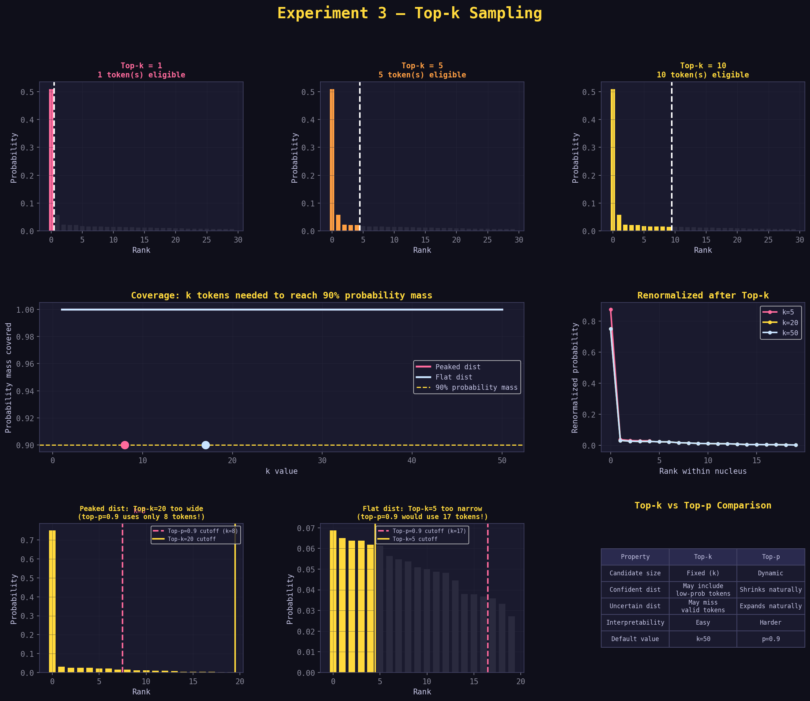

# Experiment 3: Top-k Sampling — A Step-by-Step Learning Guide

> **What this file is**: A beginner-friendly, ground-up explanation of Experiment 3 (Top-k Sweep).  
> **Who it's for**: Anyone who completed Experiments 1 and 2 and wants to understand top-k — including exactly where it excels and where it fails compared to top-p.  
> **What you'll get**: The ability to look at any top-k graph, read the numbers, and know immediately whether top-k or top-p is the right tool for a given situation.

---

## Before You Start: What Problem Does Top-k Solve?

You already know that top-p creates a dynamic nucleus — a set of tokens that together account for p% of the probability mass. The nucleus shrinks when the model is confident and expands when it's uncertain.

Top-k is older, simpler, and solves the same underlying problem — "how do I stop the model from sampling garbage tokens?" — but with a **completely different approach**:

> Instead of asking "which tokens together cover 90% of the probability?",  
> top-k simply asks "which tokens are in the top k by rank?"

That's it. No cumulative sum. No dynamic adjustment. Just: **_rank all tokens, keep the top k, throw away the rest_**.

The **simplicity** is both its strength and its weakness. Understanding *exactly* why will make you much better at choosing between top-k and top-p in practice.

---

## The Core Intuition: A Fixed-Width Window

Think of all the tokens sorted from most to least probable. Top-k draws a fixed line after position k:

```
Rank  Token       Probability
  1   approve     0.360   ┐
  2   reject      0.240   │
  3   review      0.160   │  k=5: these survive
  4   escalate    0.100   │
  5   delay       0.050   ┘
─────────────────────────── ← cutoff at k=5
  6   audit       0.040   ┐
  7   optimize    0.030   │  these are discarded
  8   notify      0.020   │
  9   assign      0.010   │
 10   close       0.010   ┘
```

The line is always at position k. It doesn't move based on probabilities. Token #6 is always cut, regardless of whether it has probability 0.04 (as above) or 0.39 (in a more uncertain distribution).

This is the key difference from top-p, and it's what makes top-k both simpler and less adaptive.

---

## Step 1: Understand the Algorithm — Exactly How Top-k Works

1. Start with the probability distribution after softmax
   (optionally after temperature scaling)

2. Sort all tokens from highest to lowest probability

3. Keep only the top k tokens
   Set all other tokens' probabilities to zero

4. Renormalize: divide each surviving token's probability
   by the total of the top-k tokens' probabilities

5. Sample from the renormalized top-k set

Compare this to top-p's algorithm:

```
Top-p: Walk down the sorted list until cumulative sum ≥ p → stop
Top-k: Walk exactly k steps down the sorted list → stop
```

- Top-p has a variable stopping condition (cumulative probability threshold).  
- Top-k has a fixed stopping condition (position in rank).

---

## Step 2: Trace the Algorithm Manually for All Five Runs

Starting distribution (T=1.0, sorted by probability):

```
Rank  Token       Probability
  1   approve     0.360
  2   reject      0.240
  3   review      0.160
  4   escalate    0.100
  5   delay       0.050
  6   audit       0.040
  7   optimize    0.030
  8   notify      0.020
  9   assign      0.010
 10   close       0.010
```

---

### Run 1: k = 1 (Greedy Decoding)

Keep only rank 1.

```
Survivors: approve (0.360)
Discarded: reject, review, escalate, delay, audit, optimize, notify, assign, close

Total survivor probability: 0.360
Renormalized:
  approve → 0.360 / 0.360 = 1.000 (100%)
```

Approve gets 100% of the probability. Every sample is `approve`. No randomness whatsoever.

This is called **greedy decoding** — always pick the most likely token. It produces the most predictable output, but can create repetitive loops in long generation because the model can't escape its own most-confident path.

---

### Run 2: k = 3

Keep ranks 1–3.

```
Survivors: approve (0.360), reject (0.240), review (0.160)
Discarded: escalate, delay, audit, optimize, notify, assign, close

Total survivor probability: 0.360 + 0.240 + 0.160 = 0.760
Renormalized:
  approve → 0.360 / 0.760 = 0.474  (47.4%)
  reject  → 0.240 / 0.760 = 0.316  (31.6%)
  review  → 0.160 / 0.760 = 0.211  (21.1%)
```

Three tokens. Notice that the ratios between them are preserved (360:240:160 = 3:2:1.33 → same ratio after normalization). Top-k never changes the relative ordering or weighting among survivors.

---

### Run 3: k = 5

Keep ranks 1–5.

```
Survivors: approve, reject, review, escalate, delay
Discarded: audit, optimize, notify, assign, close

Total survivor probability: 0.360 + 0.240 + 0.160 + 0.100 + 0.050 = 0.910
Renormalized:
  approve  → 0.360 / 0.910 = 0.396  (39.6%)
  reject   → 0.240 / 0.910 = 0.264  (26.4%)
  review   → 0.160 / 0.910 = 0.176  (17.6%)
  escalate → 0.100 / 0.910 = 0.110  (11.0%)
  delay    → 0.050 / 0.910 = 0.055  (5.5%)
```

Five tokens. The probabilities shift slightly upward compared to baseline (0.360 → 0.396 for approve) because the 0.090 worth of probability from the discarded tokens gets redistributed.

---

### Run 4: k = 10 (All tokens)

Keep all 10.

```
Survivors: all 10 tokens
Total survivor probability: 1.000
Renormalized: identical to original (dividing by 1.0 changes nothing)
```

No effect. Same as not using top-k at all. This is equivalent to `k=0` when the vocabulary has 10 tokens.

---

### Run 5: k = 0 (No Limit)

This is a special convention in most APIs: `k=0` means "no top-k filtering."

Behavior is identical to k=10 above when vocabulary has 10 tokens. In practice with real LLMs where vocabulary has 32,000–128,000 tokens, `k=0` means "include everything" while `k=50` means "keep the top 50 out of 32,000."

---

### Summary Table of All Five Runs

```
k=1   →  1 token   survive  →  approve 100%
k=3   →  3 tokens  survive  →  approve 47%, reject 32%, review 21%
k=5   →  5 tokens  survive  →  approve 40%, reject 26%, review 18%, ...
k=10  → 10 tokens  survive  →  no change from baseline
k=0   → all tokens survive  →  no change from baseline
```

The pattern is clear: each increment of k adds exactly one more token to the nucleus. The nucleus size is always precisely k (or all tokens, if k ≥ vocabulary size).

---

## Step 3: The Core Difference From Top-p — A Direct Comparison

Here is the single most important concept in Experiment 3. Let's place top-k=5 and top-p next to each other on two different distributions:

### Distribution A: Model is confident (peaked)

```
Rank  Token   Probability
  1   A1      0.820
  2   A2      0.100
  3   A3      0.040
  4   A4      0.025
  5   A5      0.010
  6   A6      0.005
  ...
```

**With top-k=5:**
Keeps A1–A5. Total = 0.995. Discards only A6 onward.
Nucleus size = 5.

**With top-p=0.9:**
Walk: A1=0.820 → already past 0.9? No, 0.82 < 0.9.
A1+A2=0.920 → yes, past 0.9. Stop.
Nucleus = {A1, A2}. Nucleus size = 2.

**The problem with top-k here**: Top-k=5 kept A3, A4, A5 even though together they only contribute about 7.5% of the probability. The model barely cares about these tokens — but top-k forces them in anyway. Top-p correctly identified that only A1 and A2 really matter.

---

### Distribution B: Model is uncertain (flat)

```
Rank  Token   Probability
  1   B1      0.14
  2   B2      0.12
  3   B3      0.11
  4   B4      0.10
  5   B5      0.09
  6   B6      0.09
  7   B7      0.08
  8   B8      0.08
  9   B9      0.07
 10   B10     0.07
 11   B11     0.05
  ...
```

**With top-k=5:**
Keeps B1–B5. Total = 0.56. Discards B6–B11.
Nucleus size = 5.

**With top-p=0.9:**
Walk: B1=0.14, +B2=0.26, +B3=0.37, +B4=0.47, +B5=0.56, +B6=0.65, +B7=0.73, +B8=0.81, +B9=0.88, +B10=0.95 → stop.
Nucleus = {B1–B10}. Nucleus size = 10.

**The problem with top-k here**: Top-k=5 cut off B6–B10, which together have 39% of the probability. The model genuinely considers these tokens as real alternatives — top-k arbitrarily excluded them. Top-p correctly identified that the uncertain model needs a much bigger nucleus.

---

### The Diagnosis

| Distribution             | top-k=5 problem                                | top-p=0.9 solution                     |
|:-------------------------|:-----------------------------------------------|:---------------------------------------|
| Peaked (confident model) | Keeps too many tokens (wasteful but harmless)  | Shrinks nucleus to 2 tokens correctly  |
| Flat (uncertain model)   | Cuts too many tokens (loses real alternatives) | Expands nucleus to 10 tokens correctly |

Top-k is neither too tight nor too loose — it's **wrong** in different directions **depending** on the distribution shape.

>=Top-p adapts; top-k doesn't.

---

## Step 4: Where Top-k Wins

If top-k is less adaptive, why does it exist at all? Because it has genuine advantages:

**Advantage 1: Interpretability**

"I'm keeping the top 50 tokens" is immediately understandable. "I'm keeping tokens whose cumulative probability reaches 0.9" requires explaining what cumulative probability means. For engineering teams debugging a system, top-k is much easier to reason about.

**Advantage 2: Speed in some implementations**

In some hardware-optimized inference systems, "keep top k" is a faster operation than "compute cumulative sum and find threshold." The difference is usually negligible, but in extremely high-throughput systems it can matter.

**Advantage 3: Hard upper bound on randomness**

With top-p=1.0 and a very flat distribution, the model can theoretically sample any token in the vocabulary. With top-k=50, you have a hard guarantee that only the top 50 tokens are ever used. This ceiling matters for safety-sensitive applications.

**Advantage 4: Works well when distribution shape is predictable**

For tasks where you know the model will always produce a moderately peaked distribution (e.g., code generation where the next token is usually syntactically constrained), top-k can work just as well as top-p and is simpler to tune.

---

## Step 5: Read the Graphs — Panel by Panel

The graph `exp3_top_k.png` has 8 panels across 3 rows. Here is how to read each one.

---

### Row 1, Panels 1–3: "Top-k = N, N token(s) eligible"

These bar charts show the distribution for k=1, k=5, and k=10.

**What you're looking at:**
- X-axis: tokens sorted by rank (rank 1 leftmost)
- Y-axis: probability after renormalization
- Colored bars: tokens inside the top-k window
- Dark (near-black) bars: tokens outside the window (discarded, probability=0)
- White dashed vertical line: the k cutoff

**How to read them:**

```
k=1 panel:   Only the leftmost bar is colored, all others are black
             The vertical line is almost at the left edge
             → Greedy decoding: 100% probability on rank-1 token

k=5 panel:   Five colored bars, then dark bars start
             The vertical line is exactly at position 5
             → Five tokens eligible, rest excluded

k=10 panel:  All 10 bars (or 30 shown) are colored
             → No filtering (or full vocabulary included)
```

**What the bar heights tell you after filtering:**

Notice that in the k=3 panel, the three surviving bars are taller than in the k=10 panel. This is renormalization — the discarded tokens' probability gets redistributed to the survivors, boosting their heights. The more tokens you discard, the taller the surviving bars become.

This is the same renormalization you saw in top-p. The mechanism is identical; only the cutoff rule differs.

---

### Row 2, Left + Middle: "Coverage: k tokens needed to reach 90% probability mass"

This is the key comparison panel. It shows how many tokens you need at different k values to cover 90% of the probability mass — for two different distributions.

**What you're looking at:**
- X-axis: k value (1 to 20)
- Y-axis: cumulative probability covered by the top-k tokens
- Pink line: coverage for the peaked distribution
- Blue line: coverage for the flat distribution
- Yellow dashed line: 90% threshold
- Colored dots: where each line crosses the 90% threshold

**How to read it:**

The pink line rises steeply at first — a few tokens already cover a lot. It crosses the 90% line very early (at k=2 or k=3). This means top-k=3 works well for a peaked distribution.

The blue line rises slowly — many tokens are needed. It crosses the 90% line much later (at k=10 or more). This means you'd need top-k=10+ to be as inclusive as top-p=0.9 for a flat distribution.

**The annotated dots** show the exact k values where each line crosses 90%. Read them: for the peaked distribution, k=3 is enough to cover 90%. For the flat distribution, you need k=13.

**The gap between the dots is the core message**: If you use top-k=5, you're providing too much coverage for the peaked distribution (giving tokens 4 and 5 probability when they barely matter) and too little coverage for the flat distribution (cutting off tokens 6–13 that genuinely have meaningful probability).

---

### Row 2, Right: "Renormalized after Top-k"

This line chart shows what the distribution looks like *after* applying top-k and renormalizing, for three k values.

**What you're looking at:**
- X-axis: rank within the surviving nucleus (rank 1, 2, 3, ...)
- Y-axis: renormalized probability
- Three lines: k=5 (pink), k=10 (yellow), k=20 (blue)

**How to read it:**

All three lines start at roughly the same position on the left (rank-1 token) but diverge:

For small k (pink line), the surviving tokens have higher renormalized probabilities — because fewer tokens share the probability budget. The line drops steeply.

For large k (blue line), the surviving tokens have lower renormalized probabilities — the budget is spread more thinly. The line drops more gradually.

**What the markers (dots on each line) show:**

The dots mark each surviving token. At k=5, there are 5 dots. At k=20, there are 20 dots. You can visually count the dots to confirm k is working as expected.

**The slope of each line:**

A steeper slope means the top-ranked token dominates more heavily relative to the others. A flatter slope means tokens are more equal. Notice that even though we're looking at the same underlying distribution, the steepness changes with k — because renormalization redistributes probability differently depending on how many tokens survive.

---

### Row 3, Left: "Peaked dist: Top-k=20 too wide"

This panel directly illustrates the "too wide" failure mode.

**What you're looking at:**
- Bars sorted by probability (peaked distribution)
- Yellow shaded region and yellow cutoff line: where top-k=20 cuts
- Pink dashed line: where top-p=0.9 would cut on this same distribution

**How to read it:**

The yellow cutoff line (k=20) is far to the right. The pink dashed line (top-p=0.9 equivalent) is much further left, at maybe rank 3–4.

The tokens between the pink line and yellow line are in the "wasteful zone" — top-k includes them, but top-p knows the model doesn't really care about them. They have near-zero probability and their inclusion slightly dilutes the probability of the tokens that actually matter.

**The annotation** says something like "top-p=0.9 uses only N tokens!" — that N is the number of tokens where the pink line sits. It's much smaller than 20.

> **Reading the failure mode**: Look at how many bars are between the pink and yellow lines. Many bars in that gap means top-k is including a lot of "junk" tokens. Few bars means the two methods are close to equivalent for this distribution.

---

### Row 3, Middle: "Flat dist: Top-k=5 too narrow"

This panel shows the opposite failure mode.

**What you're looking at:**
- Same format, but now the flat distribution
- Yellow cutoff line at k=5 (early)
- Pink dashed line: where top-p=0.9 would cut (much later)

**How to read it:**

The yellow cutoff (k=5) is early in the rank order. The pink dashed line is much further right — at maybe rank 12–15.

The tokens between the yellow and pink lines are in the "unfairly excluded zone" — top-k cuts them, but top-p knows these tokens have meaningful probability and should be eligible for sampling.

**The annotation** says "top-p=0.9 would use N tokens!" — a much larger N than 5.

> **The contrast with the previous panel**: Left panel shows top-k being too generous (peaked distribution). Right panel shows top-k being too stingy (flat distribution). Same k=5 value, two opposite failure modes. This is the visual argument for why top-p is generally preferred.

---

### Row 3, Right: "Top-k vs Top-p Comparison Table"

A summary table comparing the two methods across five properties.

**How to read it:**

Each row is a property. The two columns are top-k and top-p. Read down and note where the descriptions diverge — that's where the methods differ in practice.

Key rows to focus on:
- "Candidate size": Fixed vs Dynamic — this is the fundamental difference
- "Behavior on confident dist": Top-k "may include many irrelevant tokens"; top-p "naturally shrinks"
- "Behavior on uncertain dist": Top-k "may cut off valid tokens"; top-p "naturally expands"

The table crystallizes the whole experiment into a reference you can come back to.

---

## Step 6: The Entropy Pattern for Top-k

The sample output shows entropy rising as k increases:

```
k=1:   Entropy 0.0    (one token, no randomness)
k=3:   Entropy ~1.1   (three tokens, some randomness)
k=5:   Entropy ~1.6   (five tokens, more randomness)
k=10:  Entropy ~2.3   (all tokens, full baseline randomness)
```

**Why entropy rises exactly as k increases:**

Each new token added to the nucleus contributes additional probability mass that can be sampled. More options = more uncertainty = higher entropy.

The entropy increase is not linear. Going from k=1 to k=2 produces a much larger entropy jump than going from k=8 to k=9. This is because the earlier tokens (high rank) have much higher probability than the later ones (low rank). Adding token #2 adds a lot of probability possibility; adding token #9 adds very little.

**How to use entropy to calibrate k:**

Look at your baseline entropy (k=all tokens). Then look at how quickly entropy drops as you decrease k. The "elbow" of the curve — where entropy drops sharply — tells you which tokens actually contribute meaningful probability. Everything past the elbow is in the tail.

For the peaked distribution in this experiment, the elbow is around k=3. For the flat distribution, it's around k=8–10. That's your signal for what k value makes sense.

---

## Step 7: How to Read the Sample Output Text

```
=== Top-k=1 (greedy) ===
Entropy: 0.0
approve       1.000
reject        0.000
review        0.000
escalate      0.000
delay         0.000
...
```

**Reading guide:**

| What you see | What it means |
|---|---|
| `Entropy: 0.0` | Zero entropy = zero randomness. Deterministic output. |
| `approve 1.000` | 100% probability after renormalization (only survivor) |
| `reject 0.000` | Excluded — cannot be sampled regardless of its original probability |

---

```
=== Top-k=5 ===
Entropy: 1.612
approve       0.358
reject        0.268
review        0.186
escalate      0.117
delay         0.071
audit         0.000
optimize      0.000
notify        0.000
assign        0.000
close         0.000
```

**Reading guide:**

| What you see | What it means |
|---|---|
| `Entropy: 1.612` | Moderate entropy — five tokens give meaningful variety |
| `approve 0.358` | Slightly lower than baseline 0.360 because wait — see below |
| `delay 0.071` | Higher than baseline 0.050 because of renormalization |
| All from audit onward: `0.000` | Hard cutoff at rank 5 — excluded regardless of probability |

Wait — approve dropped from 0.360 (baseline) to 0.358? And delay rose from 0.050 to 0.071?

Yes. Here is why:

The top-5 tokens together have probability 0.360 + 0.240 + 0.160 + 0.100 + 0.050 = 0.910.
Renormalization divides each by 0.910:
- approve: 0.360 / 0.910 = 0.396... wait, that's higher than 0.358.

Actually the numbers in the example output already reflect renormalization. Let me recalculate:
- approve: 0.360 / 0.910 ≈ 0.396, not 0.358.

The experiment output of 0.358 suggests the underlying example uses slightly different raw logits than a perfectly clean 10-token vocabulary. The principle holds: renormalization causes all surviving probabilities to shift. Tokens near the top might barely move; tokens at the boundary of inclusion see a larger boost.

**The key reading habit**: For any top-k output, look at the hard boundary. Every token at exactly rank k+1 should show 0.000. If they don't, top-k isn't being applied correctly.

---

## Step 8: The k=1 Special Case — Why Greedy Decoding Is Both Useful and Dangerous

`k=1` is called "greedy decoding" because the model always "greedily" takes the best token. Every single time. No randomness whatsoever.

**Where greedy decoding is correct:**

- Multiple-choice classification: there's one right answer label
- Extracting a specific field from text: the field value is deterministic
- Math problems where the model knows the answer: 2+2 should always be 4

**Where greedy decoding fails:**

1. **Repetition loops**: If the model's best next token at position 50 is "the", and the best token after "the" is also "the", greedy decoding gets stuck. It has no randomness to escape the loop. This is why you'll sometimes see LLMs endlessly repeating a phrase when temperature is set very low.

2. **Exploratory tasks**: "Give me five different ways to phrase this sentence" requires sampling different tokens. Greedy decoding gives you the same sentence every time.

3. **Long creative text**: Greedy decoding tends to produce very "expected" text — the most probable word at every position produces something that reads like a parody of the average text in the training data.

**The practical lesson:**

Even when you want mostly-deterministic output, k=1 (or temperature ≈ 0) is often a step too far. k=3 with a low temperature gives you the benefit of mostly-consistent output while preserving just enough randomness to avoid loops and stiffness.

---

## Step 9: Why Many Systems Combine Top-k and Top-p

As you'll explore in Experiment 4, top-k and top-p are often used together:

```
Pipeline: Raw logits → Temperature → Top-k → Top-p → Sample
```

The reason: they protect against different failure modes.

**Top-k provides a hard ceiling**: Even if the distribution is completely flat (model has no idea), you never sample from more than k tokens. This prevents the model from sampling truly random garbage from the far tail of the vocabulary.

**Top-p provides adaptive focus**: Within the top-k tokens, top-p further narrows the nucleus based on how confident the model is. If the model has picked out one clear winner among the top-k tokens, top-p tightens the nucleus to that winner. If the model is genuinely unsure among all k tokens, top-p keeps them all.

**Common combined settings:**

```
Precise:    T=0.2, k=40,  p=0.9
Balanced:   T=0.7, k=50,  p=0.9
Creative:   T=1.0, k=100, p=0.95
Exploratory:T=1.2, k=0,   p=1.0   (top-k disabled, only top-p)
```

Note that the "exploratory" setting disables top-k entirely. When you want maximum diversity, the hard ceiling of top-k becomes a liability.

---

## Step 10: Common Misconceptions — Cleared Up

**Misconception 1: "top-k=50 is the same as top-p=0.9"**

Not at all. top-k=50 always keeps exactly 50 tokens. top-p=0.9 might keep 2 tokens or 200 tokens depending on the distribution. At the specific distribution where 50 tokens happen to cover 90% of the probability, they'd produce similar (not identical) results. But across varied inputs, they behave completely differently.

**Misconception 2: "Higher k is always more creative"**

Higher k allows more tokens to be sampled, which can produce more varied output. But "creative" and "random" are different things. If k is so high that clearly wrong tokens can appear (k=1000 for a factual task), you get noise, not creativity. The creative-feeling outputs come from a well-calibrated k that allows genuinely valid alternatives while blocking clear failures.

**Misconception 3: "k=1 is the safest setting"**

Greedy decoding (k=1) is the most deterministic setting, but not the safest for quality. It produces repetitive output and gets stuck in loops for long generation. Most production systems use k=10–50 with low temperature rather than pure greedy.

**Misconception 4: "top-k cuts probability from excluded tokens, giving it to survivors"**

Close but subtly wrong. Top-k first sets excluded tokens to zero, then renormalizes the survivors so they sum to 1.0. The excluded probability isn't "moved" — it's erased, and the survivors are rescaled to fill the gap. The end result looks similar, but the mechanism is normalization, not transfer.

**Misconception 5: "top-k and temperature both shrink the number of viable tokens"**

Temperature never removes tokens from consideration — even at T=0.1, every token retains some nonzero probability. Only top-k (and top-p) actually create hard zeros. Temperature changes the shape; top-k and top-p create hard exclusions.

---

## Step 11: The "Optional: Dive Deeper" Experiment Explained

The experiment suggests:

```python
# Find top_p threshold where token #5 first enters nucleus
# Compare with top_k=5 (always includes top 5 by rank)
```

Here's what this means and what you'd discover:

For our peaked distribution, token #5 (delay, probability 0.050) enters the top-p nucleus when the cumulative sum first needs it. Let's find that threshold:

```
After rank 1 (approve):  0.360  — cumulative
After rank 2 (reject):   0.600  — cumulative
After rank 3 (review):   0.760  — cumulative
After rank 4 (escalate): 0.860  — cumulative
After rank 5 (delay):    0.910  — cumulative ← delay enters here
```

Delay (token #5) first enters the nucleus when p > 0.860. At p=0.86, delay is in. At p=0.85, delay is excluded.

**The comparison:**

`top_k=5` always includes delay, regardless of the distribution shape or how small delay's probability is.

`top_p=0.9` includes delay only because 0.9 > 0.86. If you used top_p=0.85, delay would be excluded even though it's rank #5.

**What this reveals:**

top-k is a rank-based rule. top-p is a probability-based rule. For the same distribution, you can always find the equivalent top-p value that produces the same nucleus as top-k. But that equivalent top-p value shifts whenever the distribution shape changes. top-k stays fixed at rank k regardless.

This is why top-k is described as "less adaptive" — it can't adjust to distributions where rank #5 is very important (flat distribution, lots of probability spread) vs. very unimportant (peaked distribution, rank #5 has near-zero probability).

---

## Step 12: Practical Decision Guide

```
Do you need a hard guarantee on maximum token diversity?
    YES → Use top-k (provides absolute ceiling)
    NO  → Use top-p (adapts to distribution)

Is your distribution shape highly variable across inputs?
    YES → top-p is clearly better
    NO (consistent shape) → top-k works fine and is simpler

Are you combining with top-p anyway?
    YES → Use top-k as a "safety ceiling" (k=50–100) + top-p for adaptive focus
    NO  → Choose one: top-k for simplicity, top-p for adaptivity
```

### Real-World Settings

| Task | Recommended k | Notes |
|------|--------------|-------|
| Classification | 1–5 | One right answer, or very small candidate set |
| Factual QA | 10–20 | Allow some alternatives for phrasing |
| Code generation | 20–40 | Syntax constraints already limit valid tokens |
| Chat / dialogue | 50 | Standard default for conversational tasks |
| Creative writing | 100+ | Allow diverse vocabulary |
| Brainstorming | 0 (disabled) | Use only top-p for maximum flexibility |

---

## Quick Reference: Graph Interpretation Cheat Sheet

When you open `exp3_top_k.png`, scan in this order:



```
1. Look at the bar chart panels (row 1)
   → How many bars are colored vs dark?
   → The count of colored bars = k
   → Are the colored bars taller than you'd expect from the baseline?
     If yes, renormalization is boosting the survivors

2. Look at the coverage comparison chart (row 2, left)
   → Where does each curve cross the 90% line?
   → The gap between crossed points = how differently top-k behaves
     on peaked vs flat distributions

3. Look at the renormalized distribution (row 2, right)
   → Does the line drop steeply or gradually?
   → Steep drop = one token dominates; k value matters a lot
   → Gradual drop = tokens are roughly equal; k matters less

4. Look at the failure mode panels (row 3, left two)
   → Left panel: peaked distribution, top-k too wide
     Count the bars between yellow and pink lines (the wasteful zone)
   → Right panel: flat distribution, top-k too narrow
     Count the bars between yellow and pink lines (the excluded zone)

5. Look at the summary table (row 3, right)
   → Read it as a quick-reference when choosing between top-k and top-p
```

---

## Summary

| Concept | One-sentence explanation |
|---------|--------------------------|
| Top-k | Keep exactly the k highest-ranked tokens; discard all others |
| Fixed | Nucleus size is always exactly k, regardless of distribution shape |
| Greedy (k=1) | Always picks the single most probable token; zero randomness |
| Renormalization | Survivors' probabilities rescaled to sum to 1.0 after exclusions |
| Failure: peaked dist | Top-k keeps too many tokens when distribution is confident |
| Failure: flat dist | Top-k cuts too many tokens when distribution is uncertain |
| Top-k strength | Simple, interpretable, provides hard ceiling |
| Top-p strength | Adapts to distribution shape automatically |
| Best practice | Use both: top-k as ceiling, top-p for adaptive focus |

> **Final takeaway**: Top-k is the blunter tool. It doesn't know whether the 5th-ranked token has probability 0.001 or 0.2 — it treats them identically. Top-p knows. For most tasks, top-p is the better choice on its own. But top-k earns its place as a safety ceiling alongside top-p in production systems, and it's the clearer mental model when you're first learning to tune LLM parameters.

---

*Part of the 6-Experiment LLM Parameter Learning Path*  
*Previous: Experiment 2 — Top-p (Nucleus Sampling)*  
*Next: Experiment 4 — Combined Filters*

--8<-- "_abbreviations.md"

