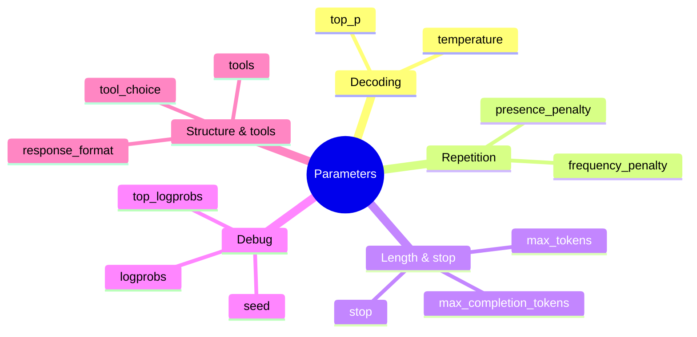

# Parameter map (what exists and why)

This section focuses on the knobs you can configure **programmatically** for Azure OpenAI Chat Completions.

## The main families

1. **Decoding / randomness**: `temperature`, `top_p`
2. **Repetition / novelty**: `frequency_penalty`, `presence_penalty`
3. **Length & stopping**: `max_tokens` / `max_completion_tokens`, `stop`
4. **Determinism & debugging**: `seed`, `logprobs`, `top_logprobs`
5. **Structure & tool calls**: `response_format`, `tools`, `tool_choice`

Azure’s REST reference and the OpenAI parameter reference define these fields and ranges.

Next: **Decoding Controls**.

--8<-- "_abbreviations.md"
